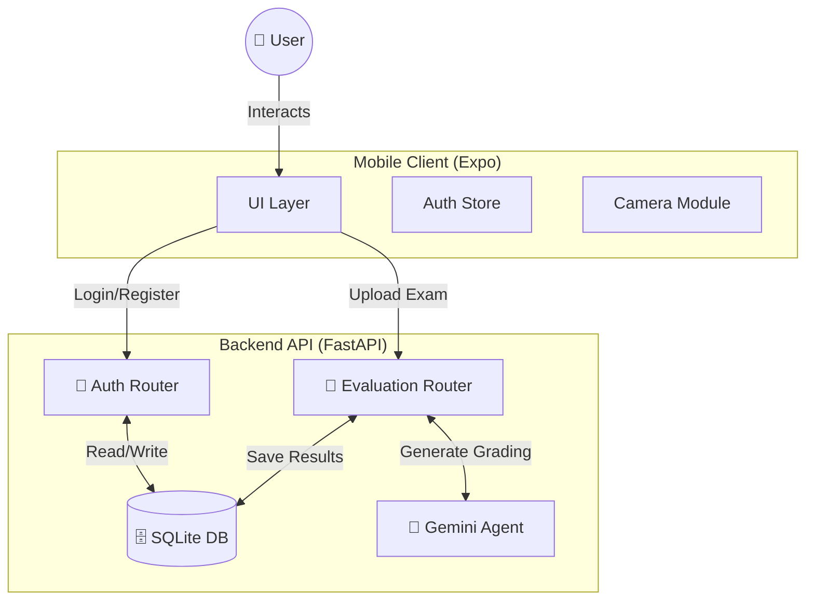

# 📐 ARCHITECTURE DESIGN

## SYSTEM OVERVIEW

The **Exam Evaluator** is a full-stack AI-powered application designed to grade physical exam papers. It consists of a **Mobile Client** (React Native/Expo) for capturing images and interaction, and a **Python API** (FastAPI) that handles authentication, image processing, and AI interaction (Google Gemini).



---

## 📁 FOLDER STRUCTURE

A monorepo structure separating the mobile frontend and python backend.

```
exam-evaluator/
├── 📱 apps/mobile/          # React Native (Expo) App
│   ├── 📂 app/              # File-based Routing (Expo Router)
│   │   ├── _layout.tsx      # Root Layout & Providers
│   │   ├── index.tsx        # Login/Welcome Screen
│   │   ├── (auth)/          # Protected Routes (Home, Profile)
│   ├── 📂 components/       # Reusable UI Components
│   ├── 📂 lib/              # Utilities (API Client, Auth State)
│   ├── ⚙️ babel.config.js    # Babel Config
│   ├── ⚙️ metro.config.js    # Bundler Config
│   └── ⚙️ tailwind.config.js # Styling Config
│
├── 🐍 apps/api/             # FastAPI Backend
│   ├── 📂 routers/          # API Endpoints (Auth, Exams)
│   ├── 🐍 main.py           # App Entry Point
│   ├── 🐍 auth.py           # JWT & Hash Logic
│   ├── 🐍 database.py       # DB Connection (SQLite)
│   └── 🐍 models.py         # SQLModel Schemas (User, Exam)
│
└── 📄 package.json          # Monorepo Scripts
```

---

## 🛠️ TECH STACK

| Layer | Technology | Purpose |
| :--- | :--- | :--- |
| **Frontend** | React Native (Expo) | Cross-platform Mobile App (iOS/Android/Web) |
| **Styling** | NativeWind (Tailwind) | Utility-first styling for Native |
| **Backend** | Windows FastAPI | High-performance Python API |
| **Database** | SQLite + SQLModel | lightweight, file-based persistence |
| **Auth** | JWT (Python-Jose) | Stateless, secure authentication |
| **AI** | Google Gemini | Vision-based grading and feedback |

---

## 🔐 DATA FLOW

### 1. Authentication
1. User enters Email/Password.
2. Mobile App sends `POST /auth/token`.
3. API validates hash, returns **JWT Token**.
4. Mobile App saves Token in memory/secure storage.

### 2. Exam Evaluation
1. User takes photo of exam.
2. App sends Image + correct answers to `POST /evaluate`.
3. API sends image to **Gemini API**.
4. Gemini returns JSON Score & Feedback.
5. API saves result to **SQLite**.
6. App displays result.
