# 🎓 Exam Evaluator

> An AI-powered mobile application for grading physical exam papers instantly using Google Gemini.


## 📚 DOCUMENTATION

We follow a systematic documentation approach.

### 1. [📐 ARCHITECTURE DESIGN](./ARCHITECTURE_DESIGN.md)
> **System Overview**: Mobile Client (Expo) <-> Python API (FastAPI) <-> SQLite DB & Gemini AI.

```mermaid
graph TD
    User((📱 User)) -->|UI| Mobile[Mobile App]
    Mobile -->|JSON| API[FastAPI Backend]
    API <-->|SQL| DB[(SQLite)]
    API <-->|Vision| AI[Gemini Agent]
```



### 2. [⚡ QUICK START](./QUICK_START.md)
**Backend**:
```bash
source .venv/bin/activate && pip install -r apps/api/requirements.txt
python -m uvicorn apps.api.main:app --host 0.0.0.0 --port 8000 --reload
```
**Frontend**:
```bash
cd apps/mobile && npm install
npx expo start
```

### 3. [✅ FEATURE INVENTORY](./FEATURE_INVENTORY.md)
- [x] **Monorepo Structure** (Expo + FastAPI)
- [x] **Backend Core** (Auth, DB, Models)
- [ ] **Frontend Auth** (Login Screens)
- [ ] **AI Grading** (Gemini Integration)

### 4. [🧪 TESTING GUIDE](./TESTING_GUIDE.md)
- **Automated**: `pytest apps/api/tests/`
- **Manual**: Register via Swagger UI, then Login via App.


## 🚀 OVERVIEW

The **Exam Evaluator** allows teachers to scan student answer sheets and receive instant, AI-generated grading and feedback.

### Key Features
-   **Mobile First**: Built with React Native for iOS and Android.
-   **AI Grading**: Uses Multimodal LLMs (Gemini Vision) to read handwriting.
-   **Secure**: Custom JWT Authentication and local database.
